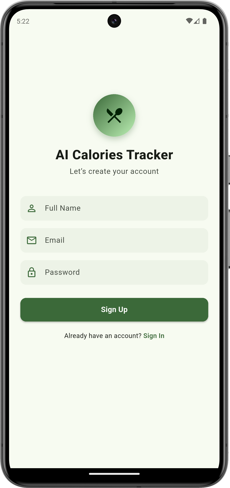
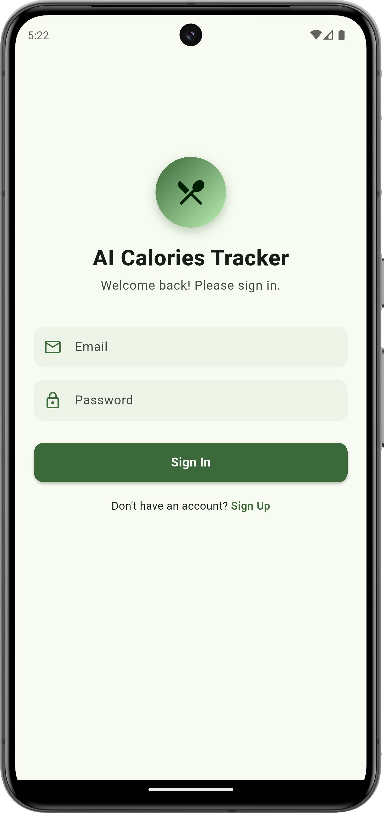
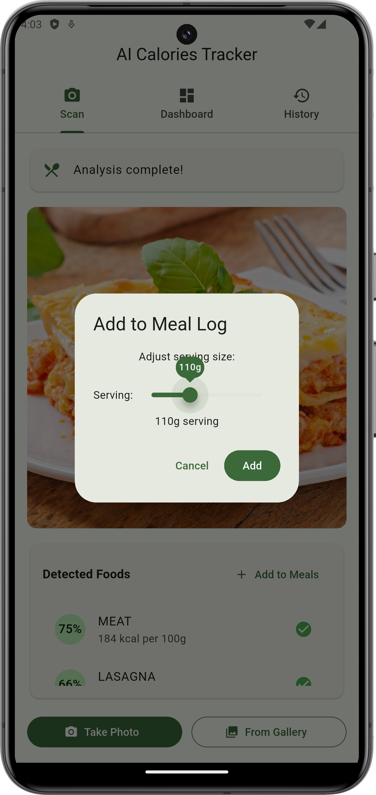
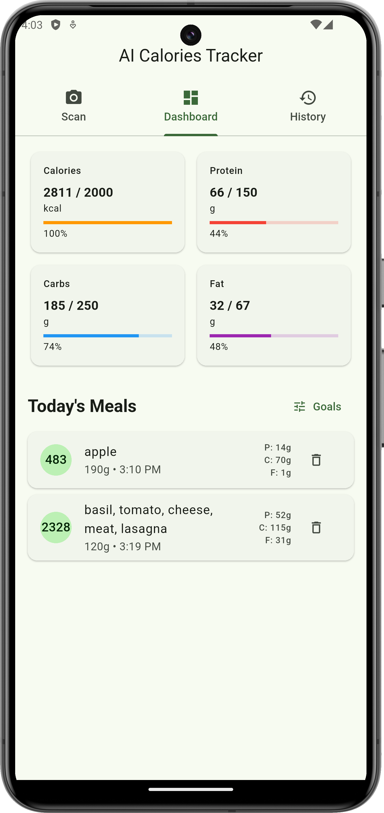

# AI Calories Tracker

[](https://flutter.dev)
[]()
[](./LICENSE)

A beautiful, lightweight Flutter app that identifies foods from photos (Clarifai), fetches nutrition facts (USDA FoodData Central), and helps you track daily calories and macros. Designed for fast local dev with dotenv and safe CI/production with --dart-define.

---

## Demo Video & Images
 
<p align="center">
  
</p>

&nbsp;&nbsp; &nbsp;&nbsp; &nbsp;&nbsp; &nbsp;&nbsp; &nbsp;&nbsp; 

---

Table of Contents
- 🔧 Quick Start
- 🧩 What it does
- 🏗 Architecture & Key Files
- 🔐 Configuration: .env & CI secrets
- 🚀 Run: Dev vs Production
- 🧠 How recognition & nutrition flow works
- 🛠 Troubleshooting & Tips
- 🔒 Security best practices
- 🧪 Testing & CI
- ✨ Roadmap & Extensibility
- 🤝 Contributing
- 📄 License & Credits

---

🔧 Quick Start (30s)
1. Clone:
   git clone <repo-url>
   cd ai_meal_planner

2. Install deps:
   flutter pub get

3. Create local `.env` (project root — DO NOT COMMIT):
   ```
   CLARIFAI_API_KEY=sk_test_xxx
   USDA_API_KEY=your_usda_key
   CLARIFAI_API_ENDPOINT=https://api.clarifai.com/vx/models/food-item-recognition/versions/xxxxxxxx/outputs
   ```

4. (Optional dev) Add `.env` to assets in pubspec.yaml:
   ```yaml
   flutter:
     assets:
       - .env
   ```

5. Clean & Run:
   flutter clean
   flutter run

> Note: Add `.env` to `.gitignore`. For production use --dart-define (see below).

---

🧩 What it does
- Detects food items in photos using Clarifai food-item-recognition model.
- Fetches nutrient details (calories, protein, carbs, fat, fiber) from USDA FDC.
- Presents detected items with confidence scores; shows nutrition per 100g.
- Lets you adjust serving size and save meals to daily log.
- Persists local data (SharedPreferences) and supports export/share.
- Has offline fallback nutrition estimates and detection heuristics when APIs fail.

---

🏗 Architecture & Key Files
- lib/
  - main.dart — app entry, dotenv loader
  - services/food_recognition_service.dart — Clarifai + USDA logic, fallbacks
  - models/ — FoodItem, NutritionInfo, MealEntry
  - ui/ — pages and widgets (Scan, Dashboard, History)
- pubspec.yaml — dependencies & assets
- .env (local dev) — API keys (ignored)
- livedemoimages/ — sample images (ignored by default)

Core technologies:
- Flutter + Dart
- Provider for state management
- flutter_dotenv for local dev config
- http package for REST calls
- SharedPreferences for local persistence

---

🔐 Configuration: .env & CI secrets

Local dev (easy):
- Create `.env` at project root (same folder as pubspec.yaml).
- Add to `.gitignore`.

Production / CI (secure - recommended):
- Use build-time define:
  flutter build apk --release \
    --dart-define=CLARIFAI_API_KEY=sk_live_xxx \
    --dart-define=USDA_API_KEY=xxxx

Code supports both:
- First tries dotenv.env,
- Falls back to String.fromEnvironment('--dart-define') if dotenv is absent.

Important: Do not bundle production secrets in a distributed app.

---

🚀 Run — Dev vs Production

Development (fast iteration):
- Use `.env` bundled as asset for convenience (not for production).
- Full restart required after changing `.env` (dotenv.load runs in main).

Production (secure):
- Don’t bundle `.env`.
- Provide keys via CI secrets using --dart-define.
- Example GitHub Actions snippet:
  ```yaml
  - name: Build APK
    run: flutter build apk --release --dart-define=CLARIFAI_API_KEY=${{ secrets.CLARIFAI_API_KEY }} --dart-define=USDA_API_KEY=${{ secrets.USDA_API_KEY }}
  ```

---

🧠 Recognition & Nutrition Flow (summary)
1. User takes/selects photo.
2. App encodes image (base64) and sends to Clarifai model endpoint.
3. Clarifai returns concepts (labels + confidence).
4. App picks top N labels (configurable threshold).
5. For each label, the app calls USDA FDC to get nutrient data. If USDA fails, the app uses local estimated nutrition map.
6. UI displays detected foods, confidence, and nutrition (per 100g). Users can adjust serving multiplier and save to log.

Design notes:
- Show confidence to the user and allow manual correction (recommended UX improvement).
- Cap number of simultaneous USDA queries; cache results to reduce rate usage.

---

🛠 Troubleshooting & Tips

Issue: ".env not found" on device/emulator
- Running app on device: CWD is `/`. The app can't read host filesystem. Either:
  - Bundle `.env` as an asset for dev, or
  - Use --dart-define.

Issue: No editor suggestions / analysis errors
- Ensure Dart & Flutter extensions installed.
- Run:
  flutter doctor -v
  flutter pub get
  Restart analysis server or IDE.

Issue: Clarifai labels incorrect
- Verify API key and endpoint.
- Inspect API response (log outputs).
- Present top few labels to user to confirm.

Network timeouts / rate limits
- Add retry/backoff and caching for repeated USDA/Clarifai requests.
- Respect API limits in production.

---

🔒 Security best practices
- Never commit real API keys to Git.
- Use CI secret stores and --dart-define for production builds.
- For highest security, move API interactions requiring a secret to your backend and issue short-lived tokens to the app.
- Audit logs to detect anomalous API usage.

---

🧪 Testing & CI
- Unit tests:
  - Nutrition parsing (USDA responses).
  - Fallback heuristics.
- Widget tests:
  - Detection results render, adding meal log behavior.
- CI pipeline recommendations:
  - Run flutter analyze, flutter test.
  - Use GitHub Actions / GitLab CI to inject secrets and build release artifacts.

Suggested GitHub Actions steps:
- checkout, set up Flutter, flutter pub get, flutter analyze, flutter test
- build with --dart-define using secrets

---

✨ Roadmap & Extensibility
Short-term:
- Manual confirmation/edit of detected foods before save
- Barcode / packaged food lookup integration
- Improve UI for multi-item plates

Long-term:
- On-device model (TF Lite) for offline recognition
- Cloud sync (user accounts and cross-device history)
- Personalized portion estimator (vision-based serving estimation)

---

🤝 Contributing
We welcome contributions! Please:
1. Fork → branch (feat/...) → commit → PR.
2. Add tests for new behavior.
3. Keep secrets out of pull requests.
4. Follow code style & provide clear PR description.

Add a `CONTRIBUTING.md` for further guidelines if desired.

---

📄 License & Credits
- License: MIT — add LICENSE file at repo root.
- Clarifai: model used under Clarifai terms.
- USDA FoodData Central: data used under FDC terms.

---

Contact / Support
Open an issue with:
- Repro steps
- Example images
- Logs / stack traces

Thanks for trying AI_Calories_Tracker — contributions, feedback, and fixes are most welcome! 🍏🥗📸
