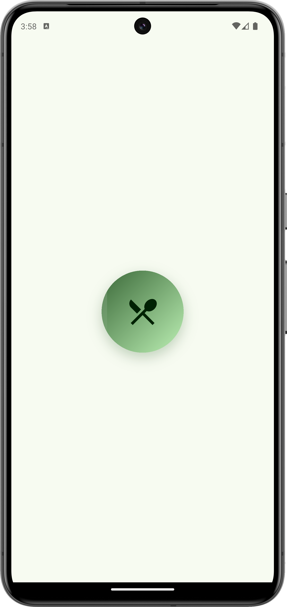

# AI Calories Tracker

[](https://flutter.dev)  []()  [](./LICENSE)

A lightweight Flutter app that recognizes foods from photos (Clarifai), fetches nutrition facts (USDA FoodData Central), and helps you track daily calories and macros. Uses Supabase as backend for auth and storing meals.

---

## Demo

<p align="center">
  
</p>

                        

---

## Table of Contents

- 🔧 Quick Start
- 🧩 Features
- 🏗 Architecture & Important Files
- 🔐 Configuration (.env & CI)
- 🚀 Run: Dev vs Production
- 🧠 How recognition & nutrition flow works
- 🛠 Troubleshooting & Tips
- 🧪 Testing & CI
- ✨ Roadmap
- 🤝 Contributing
- 📄 License & Credits

---

## 🔧 Quick Start (30s)

1. Clone:
```bash
git clone <repo-url>
cd ai_meal_planner
```

2. Install dependencies:
```bash
flutter pub get
```

3. Create local `.env` (project root — DO NOT COMMIT). Example keys the app looks for:
```
CLARIFAI_API_ENDPOINT=
CLARIFAI_API_KEY=
USDA_API_KEY=
SUPABASE_URL=
SUPABASE_ANONKEY=
```

4. (Optional dev) Add `.env` to `pubspec.yaml` assets (use only for local development):
```yaml
flutter:
  assets:
    - .env
```

5. Clean & Run:
```bash
flutter clean
flutter run
```

> Note: For production builds, use `--dart-define` to pass secrets (see below).

---

## 🧩 Features

- Food recognition via Clarifai (image -> labels + confidence).
- Nutrition lookup via USDA FoodData Central (per-100g data).
- Proportion estimation per detected item (confidence × calorie density).
- Adjust serving (grams) and add to daily meal log.
- Persist meals to Supabase (per-user) and local state update.
- Offline fallbacks: simple recognition heuristics and estimated nutrition map.
- Non-blocking notifications (SnackBar) for sign-in and operations.
- Global scaffold messenger to avoid context issues when showing snackbars.

---

## 🏗 Architecture & Key Files

- lib/
  - main.dart — app entry, ScaffoldMessenger key
  - services/
    - supabase_service.dart — Supabase REST auth, profile, meals, cache
    - food_recognition_service.dart — Clarifai + USDA + fallbacks
  - models/
    - calories_tracker_model.dart — Provider state, image analysis, persistence
    - meal_entry.dart, user_profile.dart — data models
  - screens/
    - auth_screen.dart — sign in / sign up (non-blocking SnackBar notifications)
    - scan_food_page.dart — image picker, analyze, add-to-meal dialog
    - main_page.dart — tabs: Scan / Dashboard / History
  - widgets/
    - user_profile_sheet.dart — user info and sign out
- livedemoimages/ — demo images
- README.md — this file

---

## 🔐 Configuration: .env & CI

Local development (convenience):
- Create `.env` with the keys above and add to `.gitignore`.

Production (secure):
- Use `--dart-define` and CI secret store. Example:
```bash
flutter build apk --release \
  --dart-define=CLARIFAI_API_KEY=${CLARIFAI_API_KEY} \
  --dart-define=USDA_API_KEY=${USDA_API_KEY} \
  --dart-define=SUPABASE_URL=${SUPABASE_URL} \
  --dart-define=SUPABASE_ANONKEY=${SUPABASE_ANONKEY}
```

The app checks dotenv first, then uses compile-time defines if dotenv isn't present.

---

## 🚀 Run — Dev vs Production

Development:
- Use `.env` (only locally).
- Full restart needed after env changes.

Production:
- Do not bundle `.env`.
- Inject keys at build time with CI secrets + `--dart-define`.

---

## 🧠 Recognition & Nutrition Flow (brief)

1. User picks/takes a photo.
2. App encodes the image and sends to Clarifai endpoint.
3. Clarifai returns labels + confidence.
4. For each label, the app queries USDA for nutrients (fallback to local map if needed).
5. Proportion for each item computed as: score = confidence × calories_per_100g → proportion = score / sum(scores).
6. User selects serving grams (G); macros per item = (G × proportion / 100) × macros_per_100g.
7. When saving, the app ensures `user_profiles` exists, inserts into `meals` table in Supabase, then reloads today's meals.

---

## 🛠 Troubleshooting & Tips

- If `saveMeal` fails with `404`: ensure `meals` table exists in Supabase.
- If it fails with `409` (FK): ensure the `user_profiles` row exists or use the app's profile creation flow (app will attempt to create it).
- If `.env` not read on device: bundle as asset for dev or use `--dart-define`.
- Check debug logs: SupabaseService prints `saveMeal status` and `saveMeal body` in debug.

---

## 🧪 Testing & CI

- Unit tests: nutrition parsing, proportion math.
- Widget tests: scan -> analyze -> add -> persisted meal flows.
- CI suggestions:
  - `flutter analyze`
  - `flutter test`
  - Build with `--dart-define` using secrets.

---

## ✨ Roadmap

Short-term:
- Manual edit of detected items and portion split UI.
- Barcode lookup for packaged foods.

Long-term:
- On-device model (TF Lite) for offline recognition.
- Cross-device sync & background sync.
- Health integrations (Google Fit / Apple Health).

---

## SQL & Supabase Setup (quick)

Run in Supabase SQL editor (creates tables and example RLS policies):

```sql
create table if not exists public.user_profiles (
  id uuid primary key,
  email text not null,
  full_name text,
  calorie_goal numeric default 2000,
  protein_goal numeric default 150,
  carbs_goal numeric default 250,
  fat_goal numeric default 67,
  created_at timestamptz default now(),
  updated_at timestamptz
);

create table if not exists public.meals (
  id uuid primary key default gen_random_uuid(),
  user_id uuid references public.user_profiles(id) on delete cascade,
  date text not null,
  timestamp timestamptz default now(),
  food_names text[],
  calories numeric,
  protein numeric,
  carbs numeric,
  fat numeric,
  serving_size text,
  image_url text
);

create table if not exists public.nutrition_cache (
  id uuid primary key default gen_random_uuid(),
  user_id uuid references public.user_profiles(id),
  food_name text,
  nutrition_data jsonb,
  cached_at timestamptz default now()
);

alter table public.meals enable row level security;
alter table public.user_profiles enable row level security;
alter table public.nutrition_cache enable row level security;

create policy "meals_user_policy" on public.meals
  for all
  using ( auth.uid()::uuid = user_id )
  with check ( auth.uid()::uuid = user_id );

create policy "profiles_user_policy" on public.user_profiles
  for all
  using ( auth.uid()::uuid = id )
  with check ( auth.uid()::uuid = id );

create policy "nutrition_cache_user_policy" on public.nutrition_cache
  for all
  using ( auth.uid()::uuid = user_id )
  with check ( auth.uid()::uuid = user_id );
```

---

## 🤝 Contributing

- Fork → create branch → make changes → open PR.
- Add tests for new features.
- Keep secrets out of commits.
- Use clear commit messages; see project Git history for examples.

---

## 📄 License & Credits

- MIT License — see LICENSE file.
- Uses Clarifai model and USDA FoodData Central per their terms.
- Supabase for auth and persistence.
